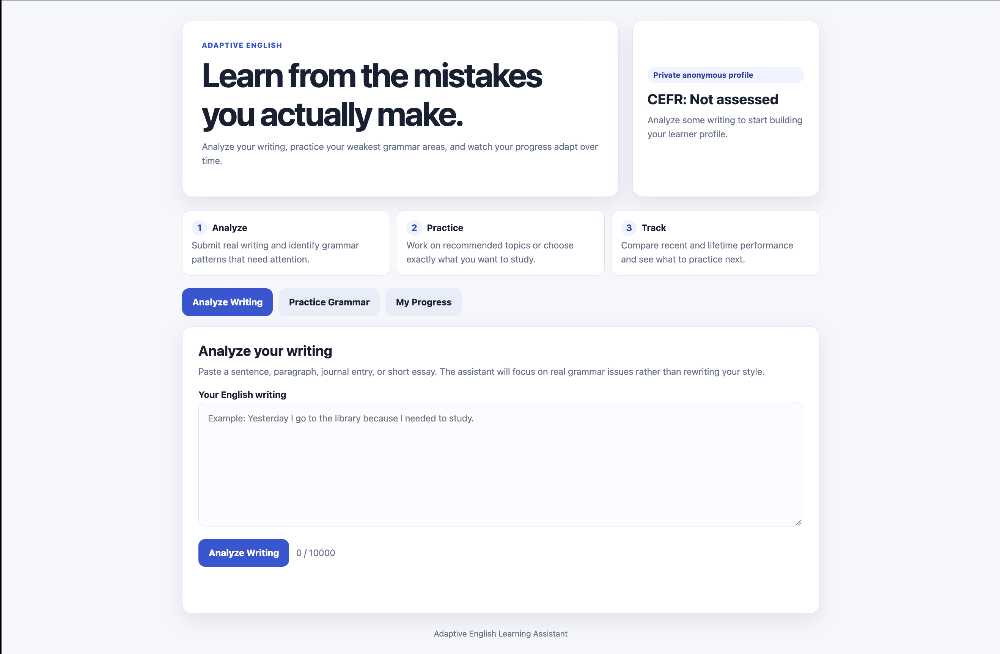
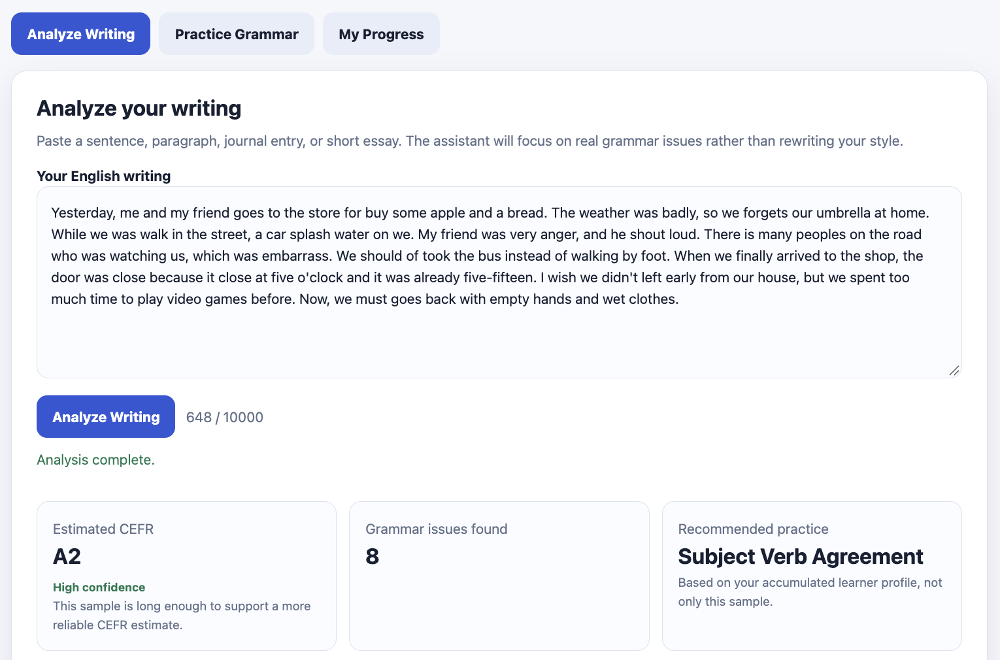
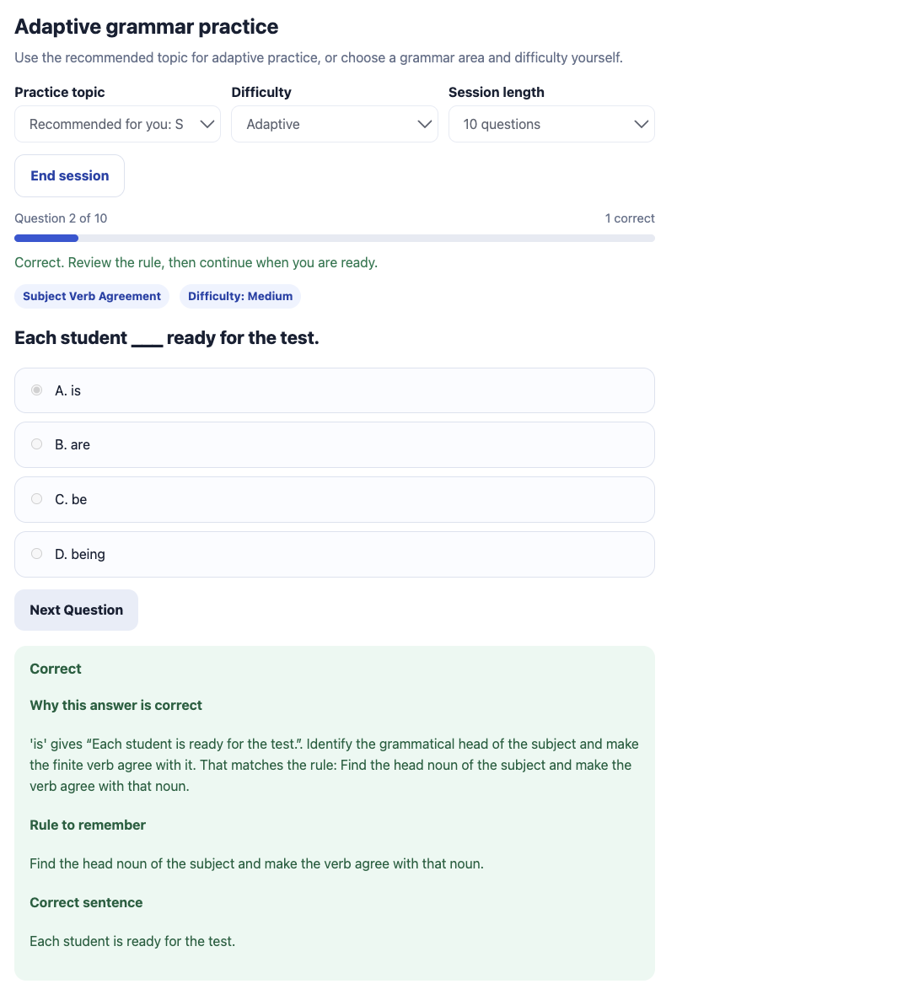
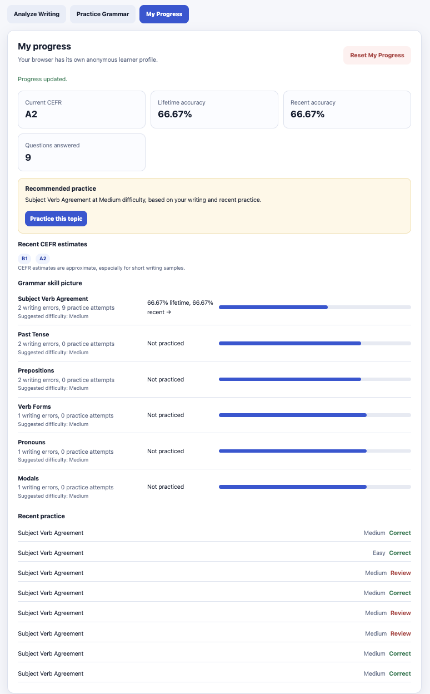

# Adaptive English Learning Assistant

An NLP based adaptive English learning system that analyzes learner writing, identifies grammar errors, estimates CEFR proficiency, and generates personalized grammar practice based on learner weaknesses.

## Overview

The Adaptive English Learning Assistant is an experimental educational NLP application designed to connect automatic writing analysis with personalized grammar practice.

Instead of giving every learner the same fixed exercises, the system analyzes learner writing, identifies recurring grammar problems, records practice performance, and uses that information to recommend practice in weaker areas.

The application uses a local language model through Ollama for language analysis and combines it with structured grammar exercises, learner performance tracking, and adaptive difficulty.

## Screenshots

### Home



### Writing Analysis



### Adaptive Grammar Practice



### Learner Progress



## Features

* English writing analysis
* Grammar error detection and correction
* CEFR level estimation from A1 to C2
* Personalized grammar practice
* Adaptive exercise difficulty
* Tracking of learner strengths and weaknesses
* Practice accuracy tracking
* Practice history
* Duplicate and near duplicate question detection
* Anonymous learner profiles
* Local learner data storage
* FastAPI backend
* Local LLM integration through Ollama

## How It Works

The application follows an adaptive learning cycle:

1. The learner submits an English writing sample.
2. The system analyzes the writing for grammar problems.
3. Errors are classified into supported grammar categories.
4. The learner profile is updated.
5. The system identifies weaker grammar areas.
6. Practice exercises are selected for those areas.
7. The learner submits answers to the exercises.
8. Accuracy and recent performance are recorded.
9. Future recommendations and exercise difficulty are adjusted according to learner performance.

## Supported Grammar Areas

The system currently supports the following grammar categories:

* Past tense
* Present tense
* Future tense
* Present perfect
* Articles
* Prepositions
* Subject verb agreement
* Verb forms
* Adjectives
* Adverbs
* Pronouns
* Conjunctions
* Conditionals
* Modal verbs
* Sentence structure
* Word order
* Countable and uncountable nouns
* Plurals
* Gerunds and infinitives
* Comparatives and superlatives

## Technologies

* Python
* FastAPI
* Pydantic
* Ollama
* Local large language model processing
* JSON based learner storage

## Project Structure

```text
Adaptive-English-Learning-Assistant-System/
├── main.py
├── learner_profile.py
├── practice_engine.py
├── requirements.txt
├── README.md
├── .gitignore
└── screenshots/
    ├── homepage.png
    ├── writing-analysis.png
    ├── practice-feedback.png
    └── progress-dashboard.png
```

## Installation

Clone the repository:

```bash
git clone https://github.com/Kelly-Hsu-test/Adaptive-English-Learning-Assistant-System.git
cd Adaptive-English-Learning-Assistant-System
```

Create a virtual environment:

```bash
python3 -m venv .venv
```

Activate the virtual environment.

On macOS or Linux:

```bash
source .venv/bin/activate
```

On Windows:

```bash
.venv\Scripts\activate
```

Install the required packages:

```bash
pip install -r requirements.txt
```

## Ollama Setup

This project uses Ollama to run the language model locally.

Install Ollama, then download the default model:

```bash
ollama pull llama3.2:3b
```

The default model is:

```text
llama3.2:3b
```

A different model can be selected using the `OLLAMA_MODEL` environment variable.

## Running the Application

Start the application with:

```bash
uvicorn main:app --reload
```

The application should then be available locally at:

```text
http://127.0.0.1:8000
```

## Learner Data

Learner profiles are stored locally in:

```text
data/learners/
```

These files contain locally generated learner information and are excluded from the Git repository through `.gitignore`.

## Privacy

The application uses anonymous learner identifiers rather than requiring users to create accounts.

Learner records are stored locally and should not be committed to the public repository.

## Current Status

This project is an experimental prototype and is under active development.

Possible future improvements include:

* More extensive evaluation of grammar analysis accuracy
* Improved learner modeling
* Expanded grammar exercise coverage
* More detailed progress visualization
* Improved adaptive exercise selection
* Broader testing across different English proficiency levels

## Project Goal

The goal of this project is to explore how Natural Language Processing and adaptive learning techniques can be combined to provide more individualized English language learning support.

The project focuses particularly on connecting automatic analysis of learner writing with personalized grammar practice, so that identified weaknesses can directly influence future exercises.
